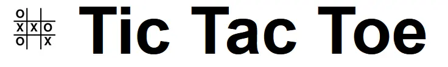
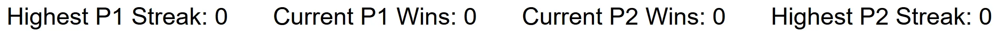
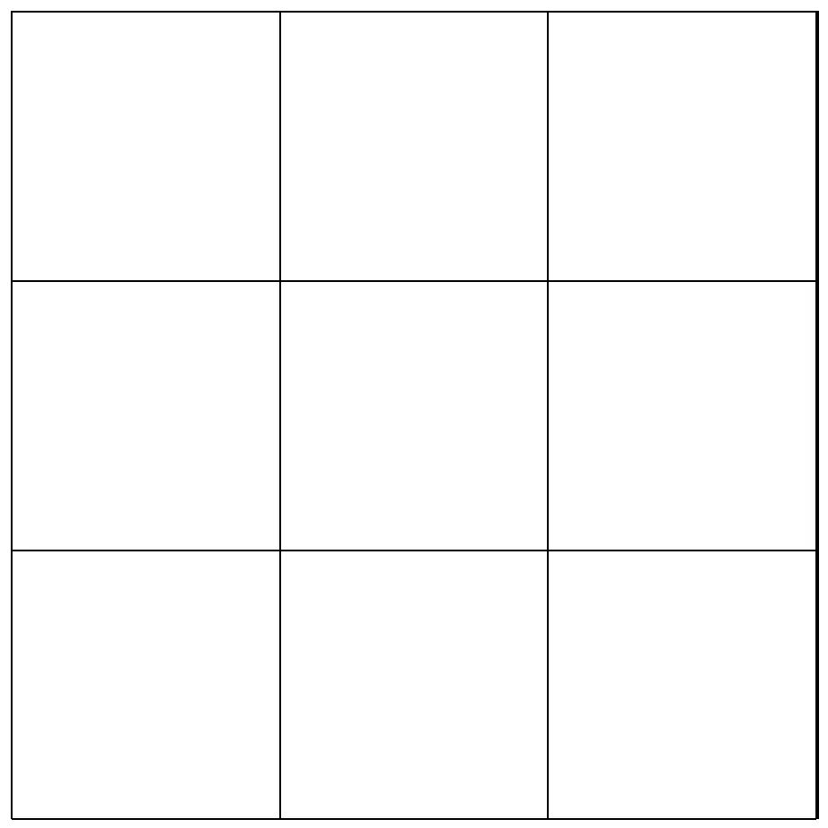
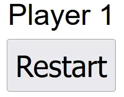
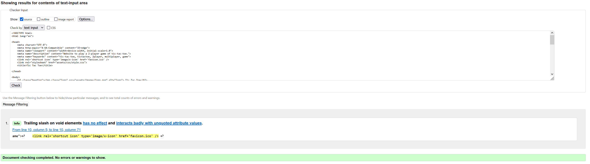
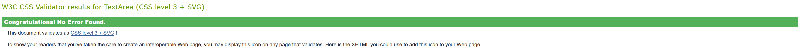
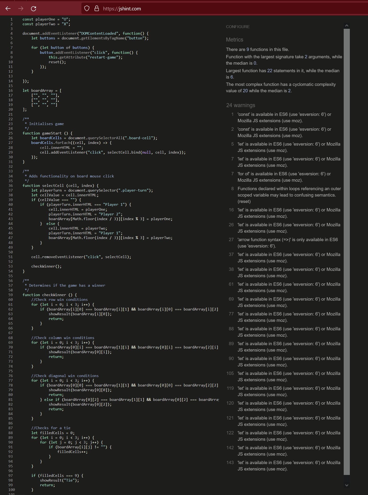

# Tic Tac Toe

Tic-Tac-Toe is a website that has a simple game of tic-tac-toe that is played with 2 players from the same device.
It will be useful to a visitor that wished to play a game with a friend that is simple, yet also has basic strategy elements.

### Existing Features

- __Header__

  - Basic header that has a simple logo and the name of the game.
  - This section will confirm to the user what the game is either by the name, or visually by the logo as the name may not be familiar to them despite knowing how to play.

- __Scores Section__

  - The Scores section keeps track of the number of wins in a row each player has achieved, as well as the highest win-streak they are on.
  - The players can clearly tell who is "winning" the game.

- __The Game Area__ 

  - The game area is the interactive part of the website which contains the board and javascript funtionality of the game itself.
  - This is the main focus of the website as it is what the players are here to do.

- __The Controls Area__

  - The controls area informs the players of whose turn it is, as well as the button to go onto the next game once one ends. 
  - This section is valuable to the players as it lets them know with minimal clutter who needs to go next.

### Features Left to Implement

- A bot that the player can play against on their own, with varying levels of difficulty.
- This would allow a single player to play the game as well.

## Testing 

The project has been tested to work on desktop, laptop, both tablet orientations, and both mobile orientations. The website will 
adjust the content depending on the screen real estate available.

The scoring system would repeat itself for the same number of times for which round it was on, which then also incremented the score by the same amount (e.g. from 3-6 after round 3).
This was discovered by placing a console.log inside the incrementScore function and checking the console, which showed that it ran multiple times (e.g. console logged 4, 5, and 6 for the aforementioned scenario).
This was then further confirmed using the debugger and setting a breakpoint on the function.
This was resolved by calling the resetGame function after the score was updated, which then ensured that the incrementScore function only ran once.

### Validator Testing 

- HTML
  - No errors were returned when passing files through the official [W3C validator](https://validator.w3.org/nu/)
  - 
- CSS
  - No errors were found when passing through the official [(Jigsaw) validator](https://jigsaw.w3.org/css-validator/)
  - 
- JS
  - Only minor warning were present when entered into JSHint [JSHint] (https://jshint.com/)
  - 

### Lighthouse Testing

- Desktop
  - All desktop testing scored above 90% in all categories through the lighthouse pagespeedinsights page (https://pagespeed.web.dev/)
  - 

- Mobile
  - All mobile testing scored above 90% except for the performance category via lighthouse
  - 

## Deployment

- The site was deployed to GitHub pages. The steps to deploy are as follows: 
  - In the GitHub repository, navigate to the Settings tab 
  - Select the Pages tab within the left column
  - From the source section drop-down menu, select the default "Deploy from a branch" option
  - In the branch section, select the "main" branch from the provided drop-down menu
  - Press the save section next to the previous drop down to publish the site
  - Wait a few moments for the website to build, which will be signified by a link appearing at the top after a refresh once sufficient time has passed

The live link can be found here - https://gdim01.github.io/project-two/ 

## Credits 

### Content 

- Many reminders / new attributes not in the Code Institute course were found on (https://www.w3schools.com/)
- Original JPEGs converted to WEBPs using (https://cloudconvert.com/jpg-to-webp)

### Media

readme-template/README.md at master · Code-Institute-Solutions/readme-template